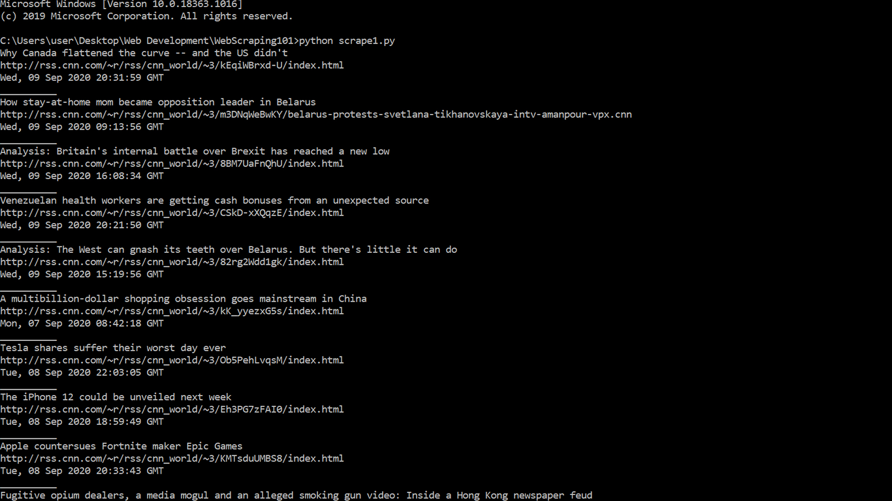

# Orion Python Developer Portfolio

Greetings! My name is Orion F. I am a self taught Python developer based out of South Carolina. While undergoing the learnings of Python, I found great interest of analysing and visualization of data. My goal is to become a Data Scientist. I am currently freelancing my works willing to relocate if necessary for experience and growth in an agency. Well let's not chat too long on my journey for you can learn more at www.DesignIsOrion.com. For now, here is my portfolio. I hope you enjoy! 

# [Project 1: CNN News Scraper: Project Overview] (https://github.com/DesignisOrion/CNN-News-Scraper)
- Created a tool that scrapes the current news events from CNN News Feed.
- Allows users to view News Feed from terminal. 
- This scraper allows you to extract the title, link and publishing date.
- Library used was BeautifulSoup4
- Module used was urllib for handling modules to request the rss feed.

## Preview Image

# [Project 2: Crypto Market Data Analysis: Project Overview] (https://github.com/DesignisOrion/Headphone-Web-Scraper-with-Email-Automation)
- Created a scraper that allows you to extract the pricing of 'Dre Beats' headphones on Amazon. 
- Allows users to email the listings under $300.00 pricing.
- Categories of Name, Price and Description of headphones will be extracted
- Setup a two step authentication using Google App Password and 2 Step Authentication of email account.
- Library used was BeautifulSoup4 with module prettify to make data clean.
- smtplib client was used to allow emails to be sent.

# [Project 3: Forde Text Editor: Project Overview] (https://github.com/DesignisOrion/Forde-Text-Editor)
- Created a simple GUI using tkinter package.
- Features included: New, Open and Exit.

