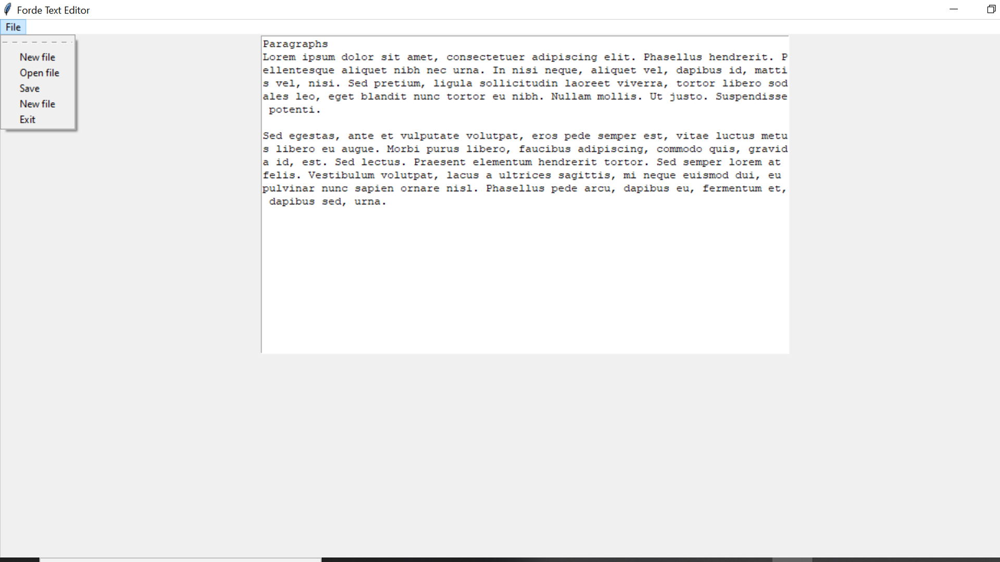
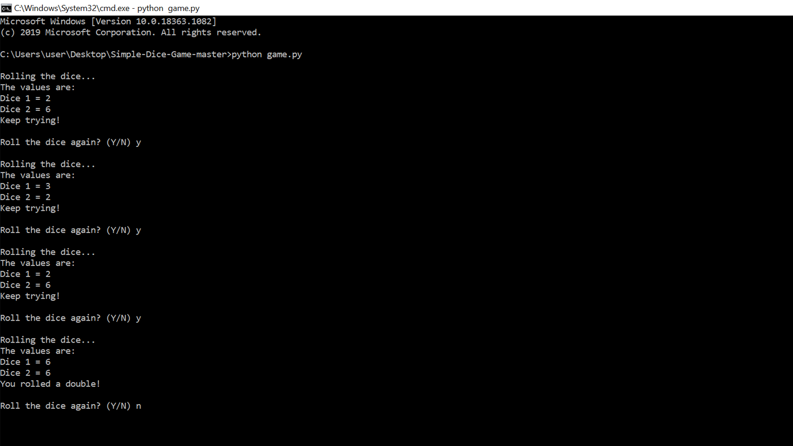

# Orion F. Portfolio
Python Developer 

## Resume 
https://docs.google.com/document/d/1_CLLGXFP6BldKMtQss259AZKcMBXcGBM10ZIFoRErbg/edit

### [Project 1: CNN News Scraper: Project Overview] (https://github.com/DesignisOrion/CNN-News-Scraper)
- Created a tool that scrapes the current news events from CNN News Feed.
- Allows users to view News Feed from terminal. 
- This scraper allows you to extract the title, link and publishing date.
- Library used was BeautifulSoup4
- Module used was urllib for handling modules to request the rss feed.

#### Preview Image

### [Project 2: Forde Text Editor: Project Overview] (https://github.com/DesignisOrion/Forde-Text-Editor)
- Created a simple GUI using tkinter package.
- Features included: New, Open and Exit.

#### Preview Image

### [Project 3: Simple Dice Game] (https://github.com/DesignisOrion/Simple-Dice-Game)
- Created a dice game that can be played within terminal. The goal is to get a double within the dice rolls vs computer.
- Used modules of random and time.

#### Preview Image

